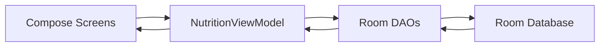

# Bia App Documentation

## Overview
Bia is a single-module Android app built with Kotlin, Jetpack Compose, and Room. It tracks daily meal groups and food entries, then summarizes calories consumed against a goal.

The app is intentionally minimal:
- Two screens: `Home` and `Add Meal`
- One local Room database (`nutrition_database`)
- A single `NutritionViewModel` that exposes flows for today's data

## Project Layout
- `app/src/main/java/com/example/bia`
- `data/` contains Room entities and type converters
- `data/database/` contains Room DAOs and the database singleton
- `ui/` contains Compose screens, composables, and theme
- `MainActivity.kt` is the app entry point and navigation host

## Entry Point and Navigation
File: `app/src/main/java/com/example/bia/MainActivity.kt`

MainActivity:
- Creates the Room database via `AppDatabase.getDatabase(context)`
- Constructs `NutritionViewModel` directly (no DI framework)
- Enables edge-to-edge rendering
- Sets Compose content with `BiaTheme`
- Configures a `NavHost` with:
  - `home` → `HomeScreen`
  - `AddMealScreen/{groupId}` → `AddMealScreen` with slide-in/out vertical transitions

Navigation behavior:
- Tapping the FAB on Home navigates to `AddMealScreen/-1`, which indicates a new group.
- Tapping the add icon on a group navigates to `AddMealScreen/<groupId>`, which adds to an existing group.

## Data Model
All entities live in `app/src/main/java/com/example/bia/data`.

### FoodItem
File: `app/src/main/java/com/example/bia/data/FoodItem.kt`
- Represents a food item with macro data per 100g/100ml.
- `unit` is `MeasureUnit.G` or `MeasureUnit.ML`.
- `lastUsed` is stored as `Instant` (converted via Room type converters).

### MealEntry
File: `app/src/main/java/com/example/bia/data/MealEntry.kt`
- Represents a single food entry inside a meal group.
- Foreign keys:
  - `foodId` → `FoodItem.id`, `onDelete = SET_NULL`
  - `groupId` → `MealGroup.id`, `onDelete = CASCADE`
- Contains `caloriesSnapshot` and `nameSnapshot` so entries still render if the food item is deleted.

### MealGroup
File: `app/src/main/java/com/example/bia/data/MealGroup.kt`
- Represents a timestamped group of meal entries (ex: breakfast).
- `title` is optional and currently defaults to `"New Group"` when created.

### MeasureUnit
File: `app/src/main/java/com/example/bia/data/MeasureUnit.kt`
- Enum of units: `G` and `ML`.

### MealCategory (unused)
File: `app/src/main/java/com/example/bia/data/MealCategory.kt`
- Defines time-of-day categories and a static list.
- Not referenced in the current UI or ViewModel.

### Type Converters
File: `app/src/main/java/com/example/bia/data/Converters.kt`
- Converts `Instant` ↔ `Long` for Room persistence.

## Database Layer
Files:
- `app/src/main/java/com/example/bia/data/database/AppDatabase.kt`
- `app/src/main/java/com/example/bia/data/database/FoodDao.kt`
- `app/src/main/java/com/example/bia/data/database/MealDao.kt`
- `app/src/main/java/com/example/bia/data/database/GroupDao.kt`

Room setup:
- Database name: `nutrition_database`
- Version: `1`
- Entities: `FoodItem`, `MealEntry`, `MealGroup`
- Type converters: `Converters`
- Singleton access via `AppDatabase.getDatabase(context)`

DAO responsibilities:
- `FoodDao` provides CRUD and `getAllFood(): Flow<List<FoodItem>>`
- `MealDao` provides CRUD and time-range queries
- `GroupDao` provides CRUD and time-range queries

## ViewModel Layer
File: `app/src/main/java/com/example/bia/ui/viewmodel/NutritionViewModel.kt`

Responsibilities:
- Computes a "today" time range based on local time zone.
- Exposes reactive flows:
  - `todaysGroups` from `GroupDao.getMealGroupsFromDateRange`
  - `todaysMeals` from `MealDao.getMealsFromDateRange`
  - `allFoods` from `FoodDao.getAllFood`
- Tracks a `calorieGoal` state flow (currently hard-coded to `2500`).
- Computes `totalCaloriesConsumed` by summing `MealEntry.caloriesSnapshot` * quantity/100.

Mutation methods:
- `addMeal(mealEntry, groupId)`
  - If `groupId == -1`, creates a new `MealGroup` titled `"New Group"`
  - Inserts the new `MealEntry` with the actual group ID
- `addFood(foodItem)`
  - Inserts a new food item
- `clearAllData()`
  - Deletes all meals, groups, and food items

## UI Layer (Compose)

### Home Screen
File: `app/src/main/java/com/example/bia/ui/screens/HomeScreen.kt`

Features:
- Displays a `CalorieRing` summary of consumed vs goal calories.
- Lists today’s `MealGroup` items and their meal counts.
- FAB to add a new meal group.
- Delete icon to clear all data, with a confirmation dialog.

Group rendering (`GroupList`):
- Shows group title or `"Meal group"` if title is null.
- Shows group time using system timezone (`HH:mm`).
- Shows item count and calories based on meal entries for that group.
- Provides an add button to append meals to the group.

### Add Meal Screen
File: `app/src/main/java/com/example/bia/ui/screens/AddMealScreen.kt`

Features:
- Top app bar with back navigation.
- A temporary "Create fake item" button that inserts a hard-coded food item.
- Lists all saved foods; tapping one creates a `MealEntry`:
  - Quantity defaults to `100f`
  - Uses current time and snapshot values from the selected food
  - Adds the entry to the provided `groupId`
  - Navigates back to Home

### CalorieRing
File: `app/src/main/java/com/example/bia/ui/composables/CalorieRing.kt`

Behavior:
- Renders a semicircular arc (with an outset) as a ring.
- Animates the filled sweep based on `consumed / goal`.
- If `consumed > goal`, renders an additional red "excess" arc.
- Text in the center shows calories left or over.

## Theme and Styling
Files:
- `app/src/main/java/com/example/bia/ui/theme/Theme.kt`
- `app/src/main/java/com/example/bia/ui/theme/Color.kt`
- `app/src/main/java/com/example/bia/ui/theme/Type.kt`

Key points:
- Uses Material 3 `MaterialTheme`.
- Uses dynamic color on Android 12+ (`dynamicColor = true`).
- Default colors are the template purple palette.

## Build and Dependencies
Files:
- `app/build.gradle.kts`
- `gradle/libs.versions.toml`

Notable dependencies:
- Jetpack Compose (Material3, UI, tooling)
- Room (runtime, KTX, KSP compiler)
- Navigation Compose
- Kotlinx Serialization JSON (present but not used in code)

SDKs:
- `minSdk = 31`
- `targetSdk = 36`
- `compileSdk = 36`

## Data Flow Summary

## Current Behavior Notes
- "Today" is computed once when `NutritionViewModel` is created; it does not automatically roll over at midnight.
- Foods are only created via the temporary "Create fake item" button on `AddMealScreen`.
- There is no edit or delete UI for individual meals or foods.
- `MealCategory` is defined but unused.
